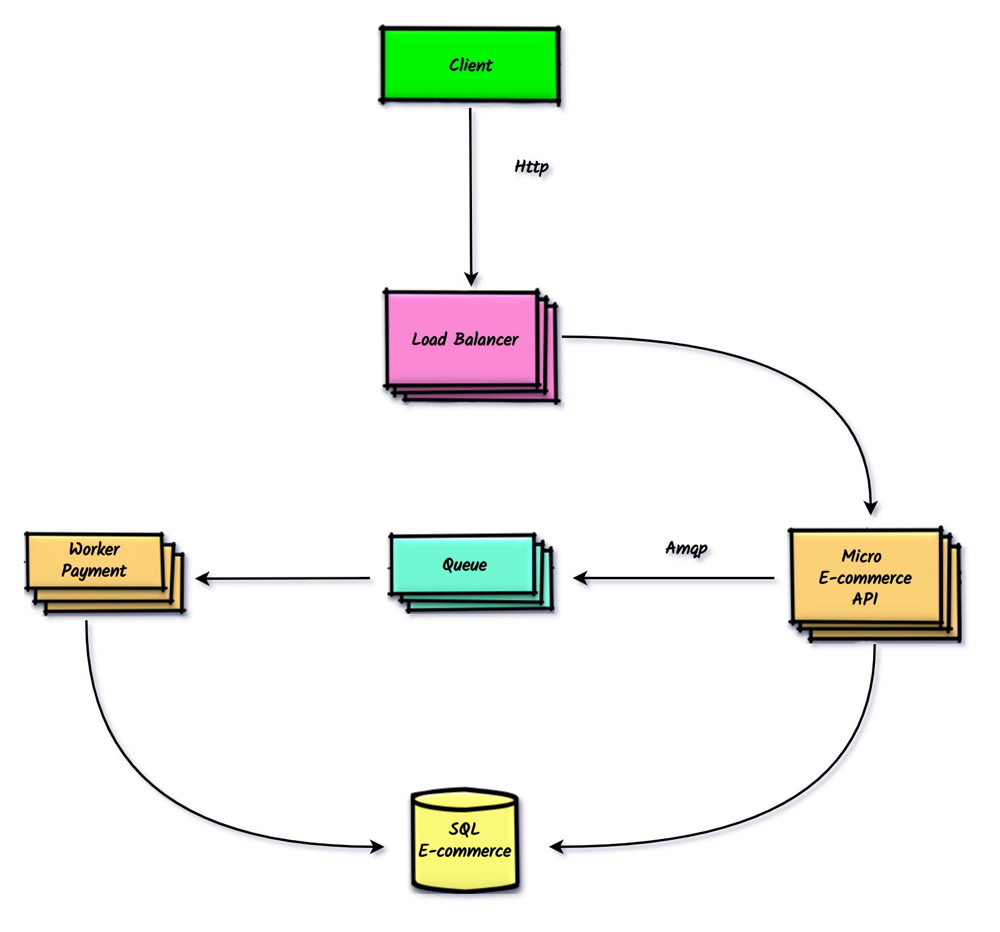

<h1 align="center">
  System E-commerce
</h1>

  
  

  

  

  

  <a href="#technologies">Technologies</a>&nbsp;&nbsp;&nbsp;|&nbsp;&nbsp;&nbsp;
  <a href="#getting-started">Getting Started</a>&nbsp;&nbsp;&nbsp;|&nbsp;&nbsp;&nbsp;
  <a href="#license">License</a>

## :warning: About the project

#### Warning, this project is an example where it can be used as a basis for building a more complex system.

## :telescope: System architecture

  

## :rocket: Technologies
* [Docker](https://www.docker.com/)
* [DockerCompose](https://docs.docker.com/compose/)
* [Django](https://www.djangoproject.com/)
* [Celery](https://docs.celeryproject.org/en/latest/django/first-steps-with-django.html)
* [Node](https://nodejs.org/en/)
* [ReactJS](https://reactjs.org/)
* [RabbitMQ](https://www.cloudamqp.com/)

## :electric_plug: Prerequisites
* Docker Compose version (>= 1.25.4)
* Docker version (>= 19.03.12)
* Node version (>= 12.18.1)
* Npm version (>= 6.14.5)
* Python (>= 3.x)

## :information_source: Getting Started
The application was built using the concepts of microservices and architected with Docker. To run, it will be necessary to run or command the docker-compose up.
Access each microservice respectively and read **README.md** to see more details on how to run.

1. [Queue rabbitMQ](https://github.com/nelsonwenner/ecommerce/tree/master/rabbitmq)
2. [Microservice ecommerce and worker](https://github.com/nelsonwenner/ecommerce/tree/master/micro-ecommerce-api)
3. [Frontend ecommerce](https://github.com/nelsonwenner/ecommerce/tree/master/frontend)

## :memo: License
This project is under the MIT license. See the [LICENSE](LICENSE.md) for more information.

---