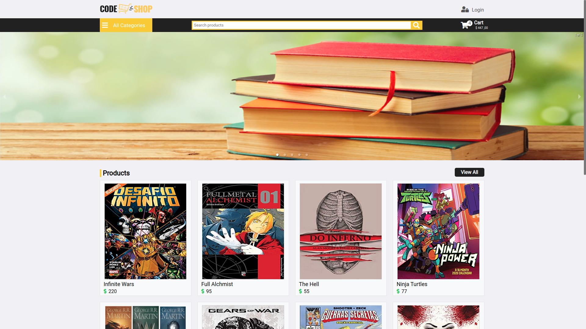

<h1 align="center">
  Frontend E-commerce
</h1>

<div align="center">
  
</div>

## :rocket: Technologies

* [ReactJS](https://reactjs.org/)
* [Node](https://nodejs.org/en/)
  
## :electric_plug: Prerequisites

- [Node.js LTS (>= 12.x)](https://nodejs.org/)

## :computer: Getting started the web application

* Go at the root of the frontend app:

```shell
$ cd frontend
```

* Create `.env` of the system 
  
```shell
$ cp .env.example .env
```

* Install dependencies

```shell
$ npm install
```

* Run the project

```shell
$ npm start
```

* Certify yourself that the backend is running on [localhost:8000](http://localhost:8000), Open frontend, the host [localhost:3000](http://localhost:3000) 
Open frontend, the host [localhost:3000](http://localhost:3000) 

---